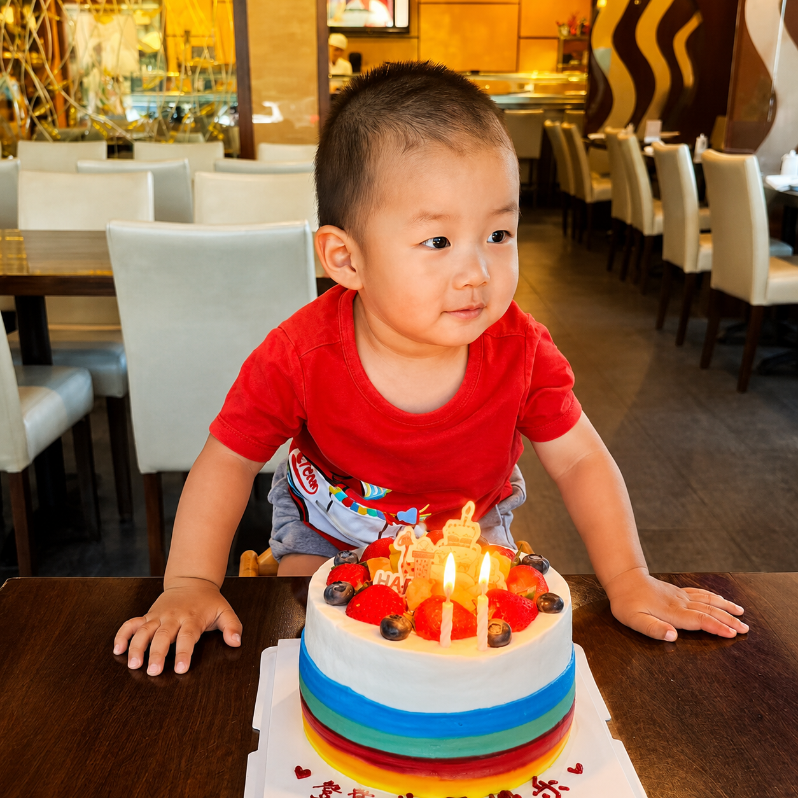

:::{#pi-info}

Hi everyone! My name is **Dengdeng**. I am 3 years old, and I am growing bigger every day.

My favorite people are Mommy and Daddy ❤️  
My favorite food is little mushrooms 🍄    
My favorite answer to everything is “No, no, no!” 😆

But my super-duper favorite is PAW Patrol! 🐶

Nice to meet you!

## Education

- **Home University** | Since June 2023
    - Major: Eating, Sleeping, Playing, Running, and Laughing
    - Advisors: Mommy and Daddy
    
:::

## Latest News

<!--
To add or edit Dengdeng's news, update the cards below.
Keep up to six cards here. Put photos in files/dengdeng/ and use paths like:
files/dengdeng/photo-name.jpg
-->

<a href="files/dengdeng/2-years.png" class="quarto-grid-link">

<h5 class="no-anchor card-title listing-title">Two Years Old 🎂</h5>

I am two years old, a bigger little boy with bigger birthday cakes!

Jun 2025

</a>

<a href="files/dengdeng/1-year.png" class="quarto-grid-link">

<h5 class="no-anchor card-title listing-title">One Year Old 🎈</h5>

I am one year old, a little boy exploring my big little world!

Jun 2024

</a>

<a href="files/dengdeng/6-months.jpg" class="quarto-grid-link">

<h5 class="no-anchor card-title listing-title">Six Months Old 🌙</h5>

I am half a year old! I do not like socks!

Jan 2024

</a>

<a href="files/dengdeng/100-days.png" class="quarto-grid-link">

<h5 class="no-anchor card-title listing-title">100 Days Old 😊</h5>

I am 100 days old, with a tiny face, tiny hands, and big smiles!

Sep 2023

</a>

