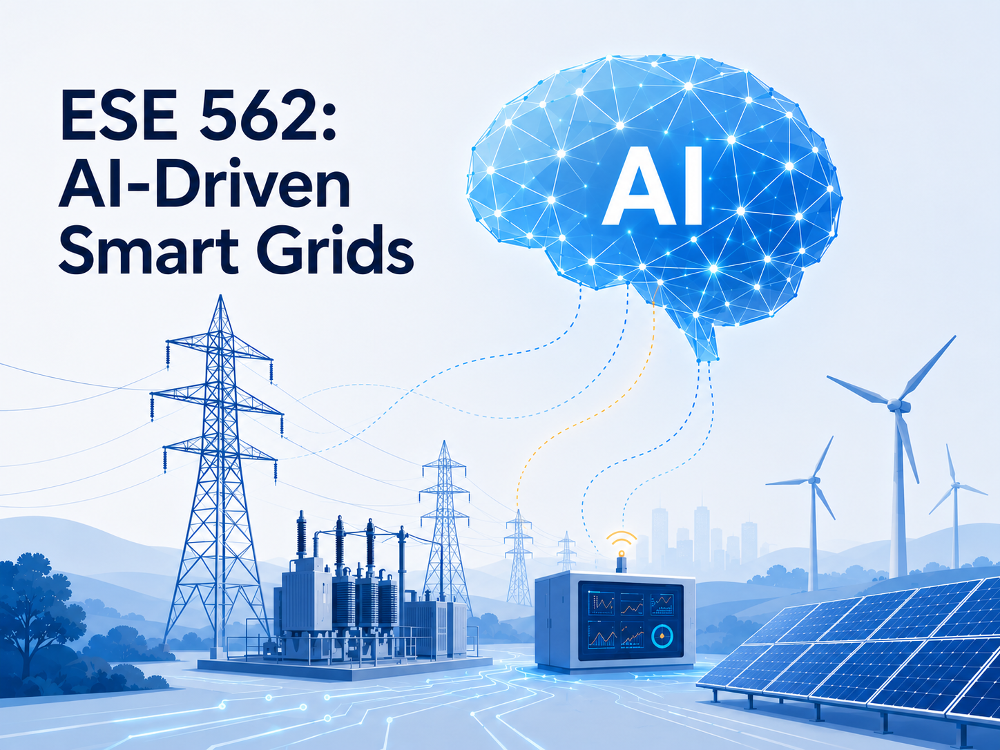
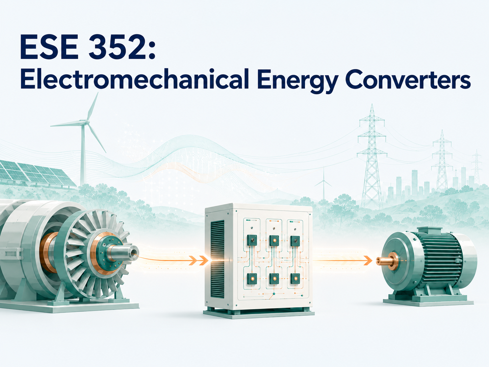
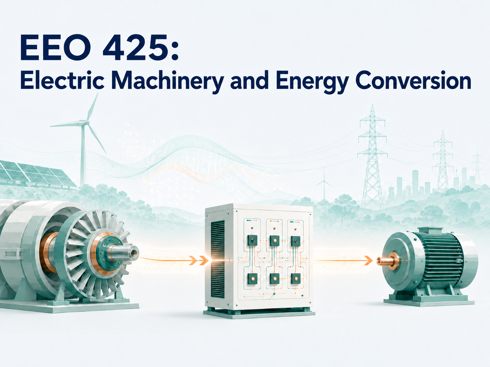
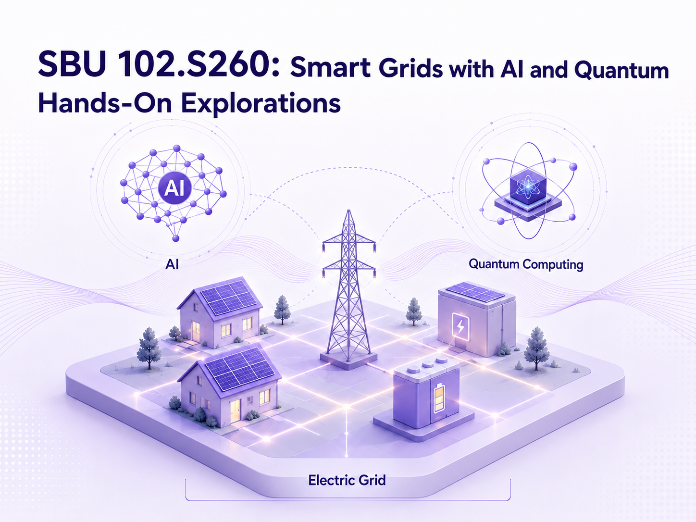
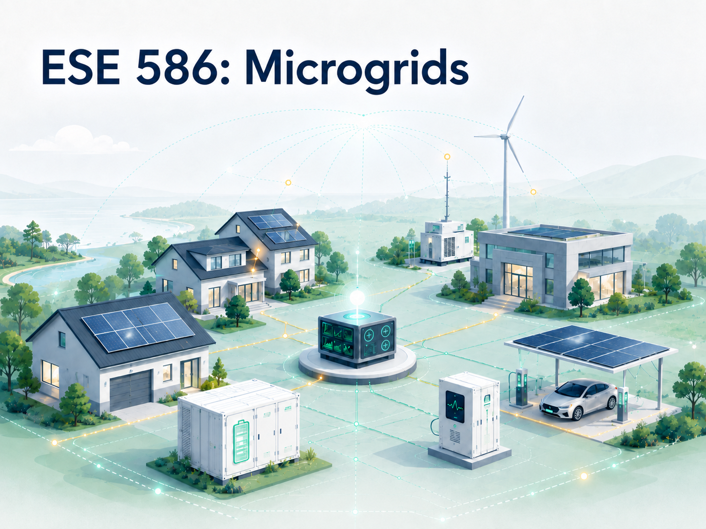

## Teaching Interests

I develop and teach courses at the intersection of power systems, artificial intelligence, and quantum computing. A central theme of my teaching is that computational methods for power systems should not be treated as black-box tools, but should be designed with guidance from the underlying physical principles of electric grids. In this spirit, I aim to help students develop both a deep understanding of grid physics and the ability to build physically grounded tools for analyzing, operating, and securing modern power systems.

## Courses

::: {.course-entry}
::: {.course-copy}

#### **ESE 562: AI-Driven Smart Grids** Graduate

Graduate course on artificial intelligence for power system modeling, analysis, and operation. 
 <!-- The course covers AI-based forecasting and system identification, AI-assisted dynamic simulation and stability/security assessment, optimal dispatch and emergency control, and emerging topics such as generative AI, quantum machine learning, and trustworthy AI for smart grids.  -->
***This course is part of the Engineering Artificial Intelligence MS program at Stony Brook University.***

**Offerings:** [Fall 2026](courses/sbu-ese562/fall2026.qmd) (opening now), [Fall 2025](courses/sbu-ese562/fall2025.qmd) (Course Evaluation: 5.0/5.0), [Fall 2024](courses/sbu-ese562/fall2024.qmd) (Course Evaluation: 5.0/5.0).

:::
{.course-figure fig-alt="ESE 562 course figure"}
:::

::: {.course-entry}
::: {.course-copy}

#### **ESE 352: Electromechanical Energy Converters** Undergraduate

Undergraduate course on the conversion between mechanical power and electric power through generators and motors.
<!-- electromechanical and inverter-based energy conversion.  -->
<!-- The course introduces the conversion of mechanical power to electric power through generators, the conversion of electric power to mechanical power through motors, and inverter-based energy conversion technologies emerging in modern power systems.  -->
*This course is an elective under the Power and Energy Systems Specialization.*

**Offerings:** [Fall 2026](courses/sbu-ese352/fall2026.qmd) (opening now), [Fall 2025](courses/sbu-ese352/fall2026.qmd) (Course Evaluation: 5.0/5.0), [Fall 2024](courses/sbu-ese352/fall2026.qmd) (Course Evaluation: --/5.0), [Fall 2023](courses/sbu-ese352/fall2026.qmd) (Course Evaluation: 5.0/5.0), [Fall 2022](courses/sbu-ese352/fall2026.qmd) (Course Evaluation: 5.0/5.0).

:::
{.course-figure fig-alt="ESE 352 course figure"}
:::

::: {.course-entry}
::: {.course-copy}

#### **EEO 425: Electric Machinery and Energy Conversion** Undergraduate

This course is the online version of ESE 352 and is *part of the Electrical Engineering Online Program in the Department of Electrical and Computer Engineering at Stony Brook University.*

**Offerings:** [Fall 2026](courses/sbu-ese352/fall2026.qmd) (opening now), [Fall 2025](courses/sbu-ese352/fall2026.qmd) (Course Evaluation: 5.0/5.0), [Fall 2024](courses/sbu-ese352/fall2026.qmd) (Course Evaluation: 5.0/5.0), [Fall 2023](courses/sbu-ese352/fall2026.qmd) (Course Evaluation: 5.0/5.0), [Fall 2022](courses/sbu-ese352/fall2026.qmd) (Course Evaluation: 4.8/5.0).

:::
{.course-figure fig-alt="EEO 425 course figure"}
:::

::: {.course-entry}
::: {.course-copy}

#### **SBU 102.S260: Smart Grids with AI and Quantum: Hands-On Explorations** Undergraduate

Undergraduate seminar introducing first-year students to modern power systems, artificial intelligence, and quantum computing through simple models and hands-on explorations. 
<!-- Students learn how electricity grids operate and how emerging AI and quantum tools may improve future energy systems.  -->
*This course is part of the Undergraduate College Seminar at Stony Brook University.*

**Offerings:** [Spring 2026](courses/sbu-sbu102/spring2026.qmd).

:::
{.course-figure fig-alt="SBU 102 course figure"}
:::

::: {.course-entry}
::: {.course-copy}

#### **ESE 586: Microgrids** Graduate

Graduate course on advanced modeling, control, resilience, and security technologies for grid modernization from the perspective of microgrid design, analysis, and operation. 
<!-- Topics include smart inverters, microgrid architectures, distributed energy resource modeling, hierarchical control, stability, fault management, networked microgrids, and cybersecurity. -->

**Offerings:** [Fall 2023](courses/sbu-ese586/fall2023.qmd) (Course Evaluation: 4.5/5.0), [Fall 2022](courses/sbu-ese586/fall2023.qmd) (Course Evaluation: 5.0/5.0).

:::
{.course-figure fig-alt="ESE 586 course figure"}
:::
